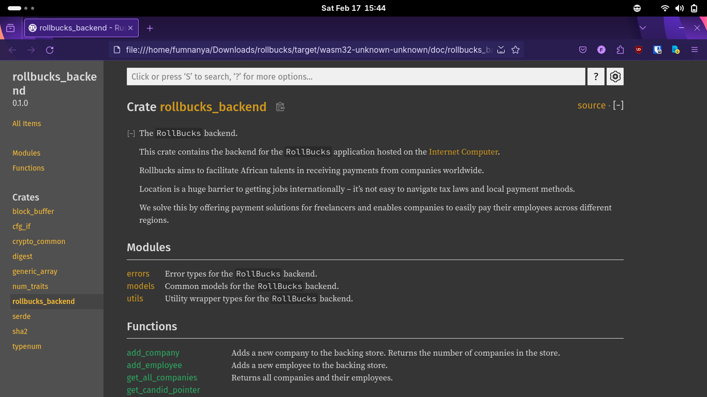
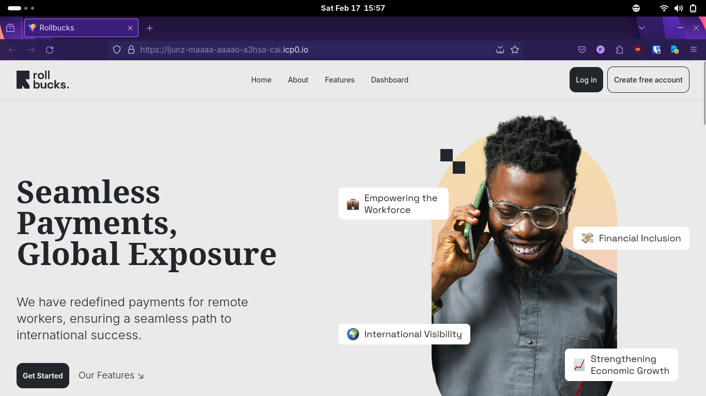
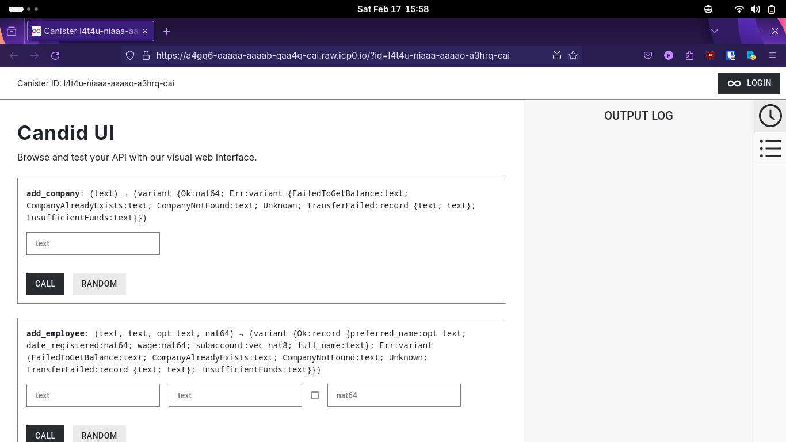

# rollbucks

> [!IMPORTANT]
> check out the frontend repo over here: [Ofure004/rollbucks_frontend](https://github.com/Ofure004/rollbucks_frontend)

rollbucks aims to facilitate African talents in receiving payments from companies worldwide.

location is a huge barrier to getting jobs internationally -- it's not easy to navigate tax laws and local payment methods. 
 
we solve this by offering payment solutions for freelancers and enables companies to easily pay their employees across different regions.

we aim to streamline the payment process for African talents by providing:

- **Freelancer Payments:** Facilitating payments for freelancers working with companies globally.
- **Company Payroll Solutions:** Offering a system for companies to efficiently pay their employees, irrespective of their location.
- **Simplified Transactions:** Offering a straightforward payment process for freelancers and companies.
- **Cross-Border Payments:** Enabling hassle-free transactions across different regions.

...and the live deployments at:

- frontend: [https://ljunz-maaaa-aaaao-a3hsa-cai.icp0.io/](https://ljunz-maaaa-aaaao-a3hsa-cai.icp0.io/)
- backend: [https://a4gq6-oaaaa-aaaab-qaa4q-cai.raw.icp0.io/?id=l4t4u-niaaa-aaaao-a3hrq-cai](https://a4gq6-oaaaa-aaaab-qaa4q-cai.raw.icp0.io/?id=l4t4u-niaaa-aaaao-a3hrq-cai)

built with love by [ofure](https://github.com/Ofure004) & [fumnanya](https://github.com/poopsicles)

## pics

|  |
|:--:|
| *The generated documentation* |

|  |
|:--:|
| *Frontend hosted on the ICP* |

|  |
|:--:|
| *Candid UI for the backend* |

## building

to build the backend:
- clone the repo

  ```sh
  $ git clone https://github.com/poopsicles/rollbucks
  ```

- run `make deploy`

  ```sh
  $ make deploy
  ...
  URLs:
  Frontend canister via browser
    rollbucks_frontend: <url>
  Backend canister via Candid interface:
    rollbucks_backend: <url>

check out the [Makefile](Makefile) for other things you might want to do.
